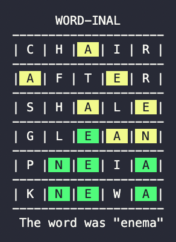

# **WORD-INAL**: a terminal-based Wordle clone
Based on the super-popular game [Wordle](https://www.nytimes.com/games/wordle/index.html), **WORD-INAL** is a terminal-based clone written entirely in C++.

  

 <strong> Figure 1. </strong> First revision of the WORD-INAL UI

## **Motivation**
I wrote this program during my Spring Break of 2022. I was super bored and didn't have any hardware or microcontrollers to work with so, in an effort to kill time during break, I wrote this game. I wanted to write it in C++ so I could get some practice in as well as display to potential employers that I can write in C++ (among other languages). 

I chose this specific program because I thought it would be fun to create a clone of one of the games I play everyday. I knew some of the challenges would be a clean UI (i.e., no echoing the user's input as standard output) and the mechanics of the game (described below). 

## **How to Play**
The rules are identical to the official Wordle rules. Players have 6 tries to guess a 5 letter word. A grey backround indicates that the specified letter does not appear in the word. A yellow backround indicates that the specified letter *does* appear in the word, however, in a different position. A green background indicates that the specified letter appears in the word *and* is in the correct spot. Use your previous guesses to help you get the word within 6 tries!

## **Gameplay**
A sample gameplay of WORD-INAL can be seen in the GIF below. The target word is GHOST for each play. In the final version, the target word is randomly selected from a list of 12,000+ words. Any 5 letter combination is valid when playing WORD-INAL.  

  

 <strong> Figure 2. </strong> Gameplay of the first version of WORD-INAL

 Type in your guesses and see how well you do!  